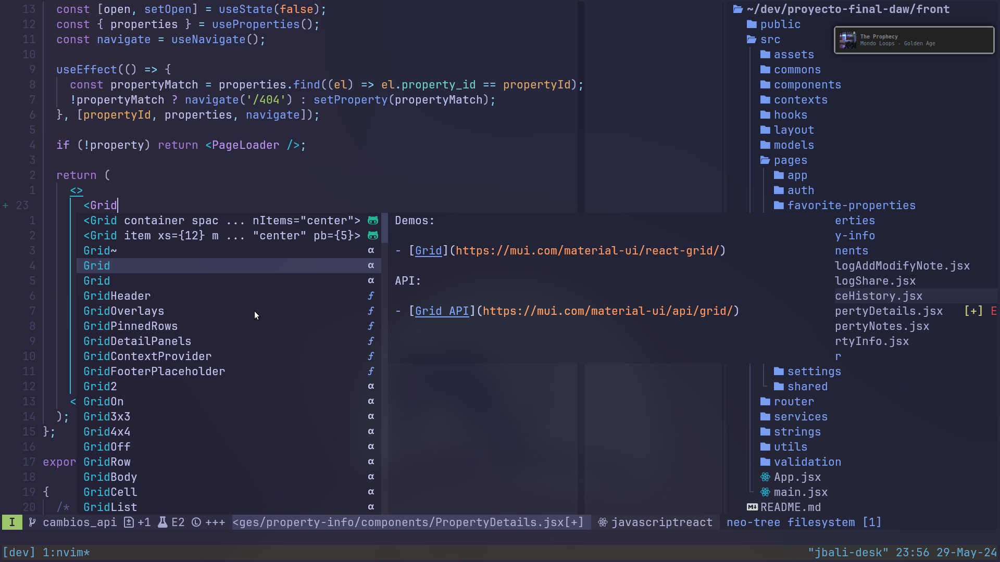
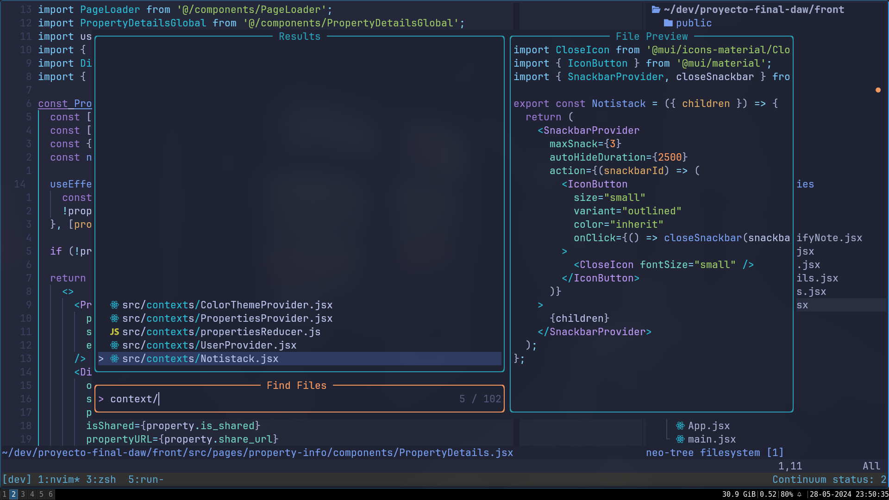
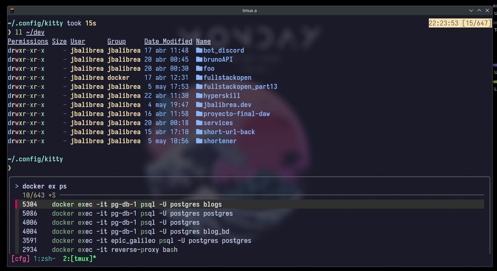

# jbalibrea dotfiles

- nvim config
- tmux config
- kitty config
- i3
- picom

## nvim conf

### Requirements

- [Neovim](https://neovim.io/) (Version 0.9 or Later)
- [Nerd Font](https://www.nerdfonts.com/) - I use JetBrainsMono Nerd Font

- [Ripgrep](https://github.com/BurntSushi/ripgrep) - For Telescope Fuzzy Finder
- Language Setup:
  - If want to write TypeScript/JavaScript, you need `node/npm`
  - If want to write Golang, you will need `go`
  - etc.

#### Neovim - Linux Install

<details><summary>Ubuntu Install Steps</summary>

```
sudo add-apt-repository ppa:neovim-ppa/unstable -y
sudo apt update
sudo apt install make gcc ripgrep unzip git xclip neovim
```

</details>

Thanks to [tjedeveries](https://github.com/tjdevries/) for inspiring me and making it easier and more accessible to learn Neovim - [kickstart](https://github.com/nvim-lua/kickstart.nvim/)
